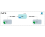

# BIND9 | DNS Docker Environment

This example shows how to use BIND9 to create a DNS environment with two DNS servers and two applications.

The `NS1` is the primary DNS server and the `NS2` is the secondary DNS server.

`NS1` only resolves `@.anubis.com` and `NS2` resolves `@.anubis.com` and `@.google.com`.

`NS1` uses `NS2` as a forwarder.

#### Start

```sh
docker compose up -d --build
```

---

### Follow the sequences below

#### 1) NS1 resolving @.anubis.com

```sh
docker compose exec app1 curl app2.anubis.com/hello
```



#### 2) NS1 forwarded @.google.com to NS2

```sh
docker compose exec app1 curl app2.google.com/hello
```


#### 3) NS1 container died and NS2 took over

```sh
docker compose stop ns1
docker compose exec app1 curl app2.anubis.com/hello
docker compose exec app1 curl app2.google.com/hello
```


---

#### App1

Calling app2 from app1 using the domain name

```sh
docker compose exec app1 curl app2.anubis.com/hello
docker compose exec app1 curl app2.google.com/hello
```

#### App2

Calling app1 from app2 using the domain name

```sh
docker compose exec app2 curl app1.anubis.com/hello
docker compose exec app2 curl app1.google.com/hello
```